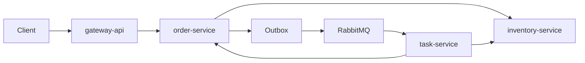
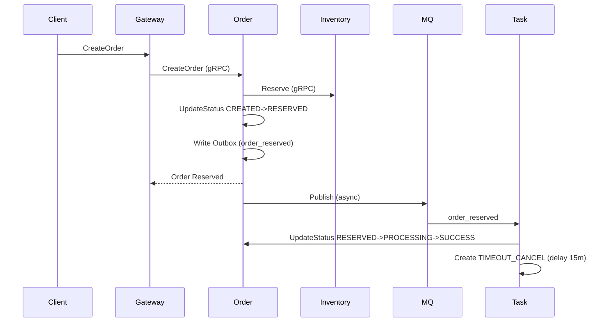

# 可观测性与部署演示

本页用于演示如何本地启动、查看 Swagger、验证 timeout cancel 链路，以及可观测性入口。

## 一、可观测性入口
- 健康检查：`/healthz`、`/readyz`
- 指标：`/metrics`
- 日志：Zap 结构化日志（标准输出）
- 链路：OpenTelemetry 预留（可按需要接入）

## 二、本地启动步骤（简版）
1. 初始化数据库  
   执行 `deploy/sql/schema.sql`
2. 启动依赖  
   MySQL、Redis、RabbitMQ
3. 启动服务  
   - gateway-api
   - order-service
   - inventory-service
   - user-service
   - task-service

## 三、Swagger 访问
手动生成：
```bash
swag init -g cmd/gateway-api/main.go -o ./docs/swagger
```
访问：`http://localhost:8080/swagger/index.html`

## 四、验证 timeout cancel
1. 通过 gateway 创建订单（状态进入 RESERVED）  
2. task-service 创建履约任务并进入 PROCESSING  
3. 同时写入 15 分钟后的 TIMEOUT_CANCEL 任务  
4. 超时任务触发后若订单未完成：  
   - 调用 CancelOrder  
   - 调用 ReleaseByOrder 幂等释放库存  
5. 聚合视图 `GET /api/v1/order-views/{order_no}` 显示 `TIMEOUT`

## 五、架构图（简化）


## 六、主链路时序图（创建订单）

