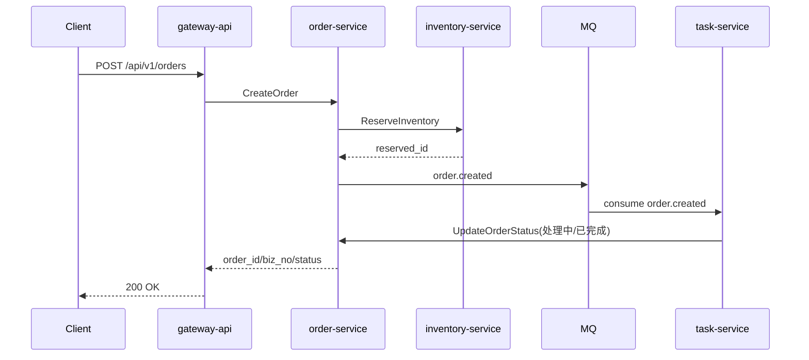
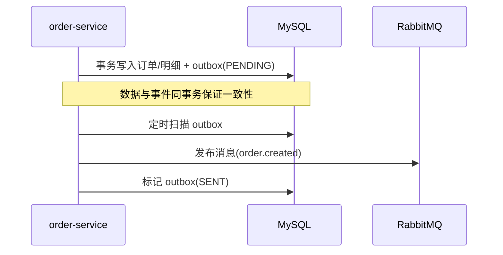
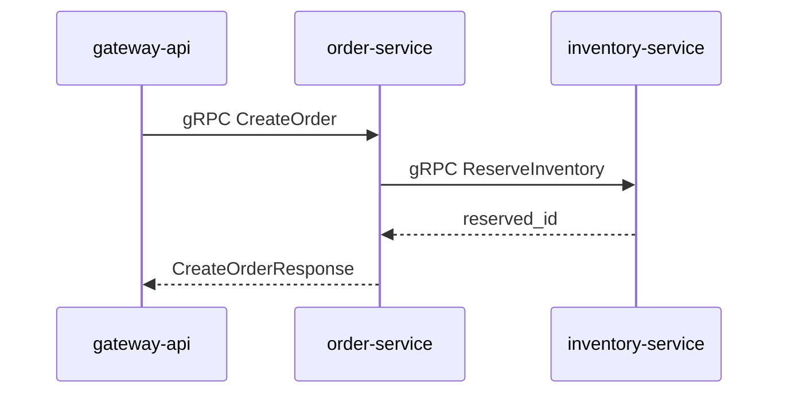
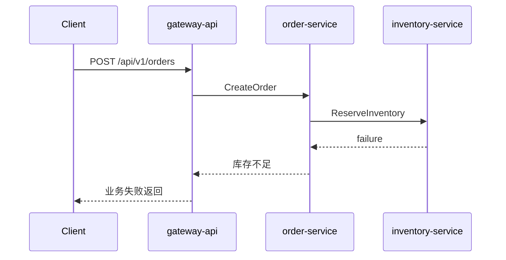
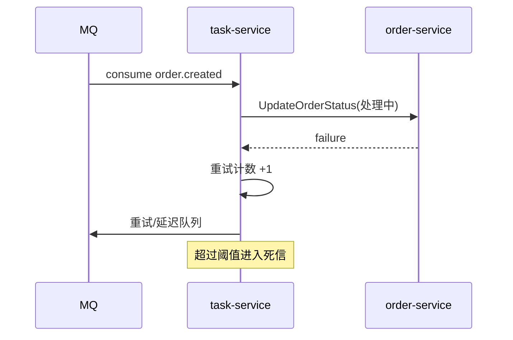

# 接口字段、表结构与时序图

本文档用于细化接口字段、数据表结构与核心业务时序，配合《项目规划与说明》使用。

## 一、接口详细字段设计

### 1. gateway-api（HTTP）

#### 1.1 创建订单
- 方法：POST `/api/v1/orders`
- 请求头：`Authorization: Bearer <token>`
- 请求体：
  - `request_id` string 必填：业务请求号（幂等 key）
  - `user_id` string 必填：下单用户 ID
  - `items` array 必填：商品明细
    - `sku_id` string 必填
    - `quantity` int 必填
    - `price` int 必填：单价，单位分
  - `remark` string 选填
- 返回：
  - `code` int
  - `message` string
  - `data` object
    - `order_id` string
    - `biz_no` string
    - `status` string

#### 1.2 查询订单
- 方法：GET `/api/v1/orders/{id}`
- 路径参数：`id` 订单 ID
- 返回：
  - `code` int
  - `message` string
  - `data` object
    - `order_id` string
    - `biz_no` string
    - `status` string
    - `total_amount` int
    - `items` array

### 2. order-service（gRPC）

#### 2.1 CreateOrder
- 请求：
  - `request_id` string
  - `user_id` string
  - `items` repeated Item
    - `sku_id` string
    - `quantity` int32
    - `price` int64
- 响应：
  - `order_id` string
  - `biz_no` string
  - `status` string

#### 2.2 GetOrder
- 请求：`order_id` string
- 响应：订单对象（同上）

#### 2.3 UpdateOrderStatus
- 请求：
  - `order_id` string
  - `status` string
  - `reason` string
- 响应：`success` bool

### 3. inventory-service（gRPC）

#### 3.1 ReserveInventory
- 请求：
  - `order_id` string
  - `items` repeated Item
- 响应：
  - `success` bool
  - `reserved_id` string

#### 3.2 ReleaseInventory
- 请求：
  - `reserved_id` string
- 响应：`success` bool

#### 3.3 ConfirmDeduct
- 请求：
  - `reserved_id` string
- 响应：`success` bool

### 4. task-service（gRPC）

#### 4.1 CreateTask
- 请求：
  - `biz_no` string
  - `order_id` string
  - `type` string
- 响应：`task_id` string

#### 4.2 RetryTask
- 请求：`task_id` string
- 响应：`success` bool

## 二、数据表结构（示例）

### 1. user-service

#### 1.1 user
- `id` bigint PK
- `user_id` varchar(64) 唯一
- `mobile` varchar(32)
- `status` tinyint
- `created_at` datetime
- `updated_at` datetime

#### 1.2 user_role
- `id` bigint PK
- `user_id` varchar(64)
- `role_id` varchar(64)
- `created_at` datetime

### 2. order-service

#### 2.1 order
- `id` bigint PK
- `order_id` varchar(64) 唯一
- `biz_no` varchar(64) 唯一
- `user_id` varchar(64)
- `status` varchar(32)
- `total_amount` bigint
- `idempotent_key` varchar(128) 唯一
- `created_at` datetime
- `updated_at` datetime

#### 2.2 order_item
- `id` bigint PK
- `order_id` varchar(64)
- `sku_id` varchar(64)
- `quantity` int
- `price` bigint

#### 2.3 order_event
- `id` bigint PK
- `order_id` varchar(64)
- `event` varchar(64)
- `detail` text
- `created_at` datetime

#### 2.4 order_outbox
- `id` bigint PK
- `event_type` varchar(64)
- `payload` json
- `status` varchar(32)
- `created_at` datetime
- `sent_at` datetime

### 3. inventory-service

#### 3.1 inventory
- `id` bigint PK
- `sku_id` varchar(64) 唯一
- `available` int
- `reserved` int
- `updated_at` datetime

#### 3.2 inventory_reserved
- `id` bigint PK
- `reserved_id` varchar(64) 唯一
- `order_id` varchar(64)
- `sku_id` varchar(64)
- `quantity` int
- `status` varchar(32)
- `created_at` datetime
- `updated_at` datetime

### 4. task-service

#### 4.1 task
- `id` bigint PK
- `task_id` varchar(64) 唯一
- `biz_no` varchar(64)
- `order_id` varchar(64)
- `type` varchar(32)
- `status` varchar(32)
- `retry_count` int
- `created_at` datetime
- `updated_at` datetime

#### 4.2 task_retry
- `id` bigint PK
- `task_id` varchar(64)
- `next_retry_at` datetime
- `retry_count` int

#### 4.3 task_deadletter
- `id` bigint PK
- `task_id` varchar(64)
- `reason` varchar(256)
- `created_at` datetime

## 三、核心业务时序图

### 1. 下单履约

### 4. Outbox + MQ 发布

### 5. gRPC 内部调用

### 2. 库存失败补偿

### 3. 任务失败重试

## 四、消息消费模型与 DLQ 配置

### 1. 消费模型
- 采用 **RabbitMQ 工作队列模型**：`order-service` 发布事件，`task-service` 作为消费者处理。
- 消费端使用 **手动 ACK**：
  - 处理成功：`ACK` 确认。
  - 非法消息：`NACK(requeue=false)` 投递到 DLQ。
  - 临时失败：`NACK(requeue=true)` 重新入队。

### 2. DLQ 设计
- 主交换机：`order.events`
- 主队列：`order.created`
- 死信交换机：`order.events.dlx`
- 死信队列：`order.created.dlq`
- 路由键：`order.created`

### 3. 配置项（环境变量）
- `MQ_URL`：RabbitMQ 连接串
- `MQ_EXCHANGE`：主交换机
- `MQ_QUEUE`：主队列
- `MQ_ROUTING_KEY`：路由键
- `MQ_DLX`：死信交换机
- `MQ_DLQ`：死信队列
