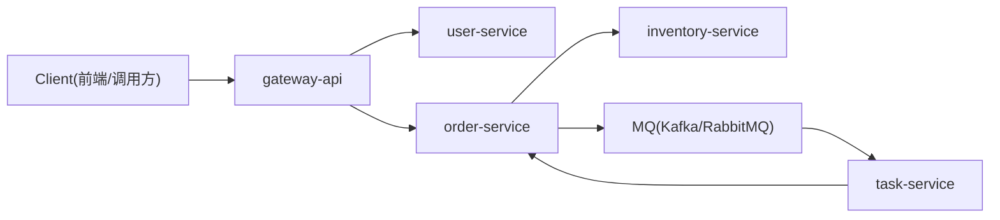

# 项目规划与说明（Go 微服务实战/面试向）

本文档先行，作为项目实现的统一说明与面试表达口径。整体目标是“既像真实业务，又能在个人时间内完成”。

## 一、项目背景

本项目面向“电商下单履约”这一高频业务场景，使用 Go 微服务体系模拟真实团队交付流程。目标是覆盖面试高频点与实际工程化能力：服务拆分、性能与稳定性、可观测性、DevOps、分布式一致性与补偿等。

## 二、项目目标与范围

### 1. 目标
- 形成一套完整的微服务实践样例，覆盖网关、用户、订单、库存、任务编排的核心链路。
- 具备基本的工程可运行性：本地/容器化启动、可观测性接入、测试与文档齐全。
- 面试表达清晰：能够讲清拆分理由、关键技术点、数据与消息可靠性策略。

### 2. 范围与边界
- 仅覆盖订单下单与履约主链路，支付、发票、营销等领域不在范围内。
- 服务间调用优先使用 gRPC；对外 HTTP 由 gateway-api 提供。
- 提供最小可用前台接口（可选），重点在后端服务能力与工程实践。

### 3. 非功能性要求
- 可用性：单服务异常不影响其他服务可用，关键链路具备降级与重试策略。
- 可靠性：消息与订单状态具备可追溯与补偿能力。
- 可观测性：完整的日志、指标、链路追踪打通。
- 可维护性：清晰的模块结构、统一配置、统一错误码与日志规范。

## 三、项目整体架构

### 1. 微服务划分

建议拆成 5 个服务，数量刚好，既像真的，又不至于做不完：

1）gateway-api

统一 API 入口，负责：
- 登录态校验
- 请求路由
- trace 透传
- 限流
- 聚合查询

2）user-service

负责：
- 用户信息
- 权限角色
- 操作人信息查询

3）order-service

核心服务，负责：
- 订单创建
- 订单状态流转
- 履约单查询
- 幂等控制

4）inventory-service

负责：
- 库存查询
- 库存预占
- 库存释放
- 扣减确认

5）task-service

负责：
- 异步任务编排
- 延迟重试
- 死信补偿
- 履约下发记录

### 2. 微服务设计（大厂规范口径）

#### 2.1 服务边界与职责
- gateway-api 只做入口治理，不承载业务状态与复杂逻辑。
- user-service 仅提供用户/角色/权限读写，不与订单/库存强耦合。
- order-service 聚焦订单生命周期与状态机，不直接修改库存表。
- inventory-service 拥有库存最终解释权，向外提供预占/释放/确认接口。
- task-service 负责异步编排与补偿执行，不参与核心订单决策。

#### 2.2 服务契约与接口稳定性
- 对外接口版本化：`/api/v1`，后续通过 `v2` 兼容演进。
- gRPC 协议定义放在独立 `proto` 目录，禁止随意破坏兼容字段。
- 统一错误码体系：业务错误、系统错误、依赖错误分层管理。

#### 2.3 依赖关系与调用方向
- gateway-api -> user-service / order-service（统一入口）
- order-service -> inventory-service（同步预占）
- order-service -> MQ（发布订单事件）
- task-service -> MQ（消费事件并编排）

调用方向约束
- 上游可依赖下游，禁止“倒流依赖”。
- 不允许跨服务直连数据库。

#### 2.4 可靠性与容错设计
- 超时：服务间 RPC 超时必须显式设置，并启用重试上限。
- 熔断：下游异常时快速失败并返回可解释错误码。
- 降级：非核心接口可返回兜底数据或空结果。
- 幂等：CreateOrder 与库存预占请求必须幂等。

#### 2.5 数据一致性与补偿
- 订单与库存不做强一致事务，使用最终一致 + 补偿策略。
- 采用“预占 + 确认扣减 + 失败释放”的库存模型。
- 任务失败进入重试队列，超过阈值进入死信队列。

### 3. 基础设施

数据层
- MySQL：业务主存储
- Redis：缓存、分布式锁、幂等 Key
- Kafka 或 RabbitMQ：异步解耦
- 若更贴近国内面试，可强调 RocketMQ 思想；项目里用 RabbitMQ/Kafka 实现

云原生
- Docker：服务容器化
- Kubernetes：部署与弹性伸缩
- Nginx Ingress：流量接入

可观测性
- Prometheus：指标采集
- Grafana：监控看板
- Loki / ELK：日志
- OpenTelemetry + Jaeger：链路追踪

### 4. 架构拓扑（逻辑视图）

## 四、项目架构设计（落地视角）

### 1. 代码与目录结构

建议采用单仓多服务布局，示例：
- `cmd/`：各服务启动入口（gateway-api、user-service、order-service、inventory-service、task-service）
- `internal/`：服务内部业务逻辑，按领域模块分层
- `pkg/`：可复用公共库（日志、配置、错误码、鉴权、链路追踪）
- `proto/`：gRPC 协议定义
- `deploy/`：Dockerfile、K8s YAML、Helm（可选）
- `docs/`：设计文档与接口说明

### 2. 运行时架构（物理视图）

核心目标是“本地可起、容器可起、K8s 可起”：
- 本地：docker-compose 一键拉起 MySQL/Redis/MQ，各服务直接运行。
- 容器：每个服务独立镜像，环境变量注入配置。
- K8s：Deployment + Service + HPA；Ingress 负责入口流量。

### 3. 配置管理与环境隔离
- 配置加载顺序：默认配置 -> 环境变量 -> 启动参数。
- 统一配置结构：`server`、`db`、`redis`、`mq`、`otel`、`log`。
- 环境隔离：`dev` / `test` / `prod` 目录或 profile 文件。

### 4. 资源与依赖治理
- 数据库与缓存连接池统一封装，避免连接泄露。
- MQ 连接独立管理，支持重连与心跳检测。
- 服务间调用统一封装 client，配置超时与重试策略。

### 5. 安全与权限
- gateway-api 做 JWT 校验，解析用户身份与角色。
- 内部服务通过 mTLS 或内网白名单约束调用来源（简化可用网段白名单）。
- 关键接口需权限校验与操作审计日志。

### 6. 可观测性落点
- 日志：入口日志 + 业务日志 + 错误日志分级输出。
- 指标：QPS、RT、错误率、MQ 积压、库存预占失败率等核心指标。
- 链路：跨服务 TraceId 透传，支持端到端排查。

### 7. 发布与回滚
- 服务版本号采用语义化（`vX.Y.Z`），与 API 版本解耦。
- 支持灰度发布（按版本分流或按用户 ID 分流）。
- 保留上一版本镜像与配置，支持快速回滚。

### 8. RPC 引入价值（内部通信）
- 降低协议歧义：IDL 明确结构，减少“字段不一致/类型不一致”问题。
- 高性能与低延迟：二进制编码 + 连接复用，适合服务间频繁调用。
- 强约束与可演进：接口版本可控，兼容性清晰，便于团队协作。
- 生态完善：天然支持拦截器、超时控制、统一治理。

### 9. 消息模型与 DLQ（异步链路）
- 模型：订单创建后发布事件，`task-service` 消费并创建履约任务。
- 可靠性：消费者显式 ACK；失败时 NACK 进入 DLQ。
- DLQ 作用：隔离异常消息、避免阻塞主队列、便于人工补偿。

## 五、项目核心业务流程

建议把主链路定成这条：

下单履约流程
- 用户提交订单请求
- gateway-api 做鉴权和参数校验
- order-service 创建订单，生成业务单号
- order-service 调 inventory-service 进行库存预占
- 预占成功后，发送“订单已创建”消息到 MQ
- task-service 消费消息，生成履约任务
- 下游处理成功后，更新订单状态为“处理中/已完成”
- 若库存失败或任务失败，进入补偿流程

为什么这个流程好
- 微服务拆分清晰
- 同步 + 异步混合架构
- 幂等
- 分布式事务
- 补偿机制
- 状态机
- 消息可靠性
- 云原生部署

## 六、技术栈建议

Go 后端
- Web：Gin
- RPC：gRPC
- ORM：GORM 或 sqlx
- 配置：Viper
- 日志：Zap
- 服务注册发现：先不强依赖，K8s 内直接用 Service DNS
- 链路追踪：OpenTelemetry
- 指标：Prometheus client_golang

基础设施
- MySQL 8
- Redis
- Kafka 或 RabbitMQ
- Docker
- Kubernetes

## 七、总体设计规范（大厂常见口径）

### 1. 架构设计原则
- 单一职责：服务与模块按业务域划分，避免跨域耦合。
- 接口稳定：对外接口与内部 RPC 定义版本化，向后兼容。
- 数据自治：每个服务独立管理自己的数据库表，禁止跨库写。
- 可演进：允许替换 MQ 或存储实现，不锁死具体中间件。

### 2. 代码与目录规范
- 统一使用 `internal` 存放核心业务逻辑，`cmd` 存放启动入口。
- 每个服务单独维护配置文件、启动脚本、Dockerfile。
- 统一错误码、统一返回结构、统一日志字段（trace_id、span_id、req_id）。

### 3. 配置与环境规范
- 配置分为 `dev` / `test` / `prod`，支持环境变量覆盖。
- 敏感信息（DB、Redis、MQ 密码）不得写死在代码或默认配置中。
- 支持 `config.yaml` + 环境变量优先级覆盖。

### 4. API 规范
- HTTP 对外接口遵循 REST 风格，返回结构统一（code/message/data）。
- RPC 使用 gRPC + protobuf，定义清晰的错误码与超时约束。
- 所有接口均要求请求参数校验与请求日志。

### 5. 幂等与一致性
- 订单创建使用幂等 Key（用户 + 业务请求号）。
- 库存预占与扣减采用 TCC 思路或预占 + 确认模式。
- 消息投递至少一次，消费端保证幂等。

## 八、服务职责与数据模型（概要）

### 1. user-service
- 用户表：user、user_role
- 关键字段：user_id、mobile、status、role_id

### 2. order-service
- 订单表：order、order_item、order_event
- 关键字段：order_id、biz_no、status、total_amount、idempotent_key

### 3. inventory-service
- 库存表：inventory、inventory_reserved
- 关键字段：sku_id、available、reserved、order_id

### 4. task-service
- 任务表：task、task_retry、task_deadletter
- 关键字段：task_id、biz_no、status、retry_count

## 九、核心接口设计（示例）

### 1. gateway-api
- POST /api/v1/orders：创建订单
- GET /api/v1/orders/{id}：查询订单

### 2. order-service (gRPC)
- CreateOrder(CreateOrderReq) returns (CreateOrderResp)
- GetOrder(GetOrderReq) returns (GetOrderResp)
- UpdateOrderStatus(UpdateOrderStatusReq) returns (UpdateOrderStatusResp)

### 3. inventory-service (gRPC)
- ReserveInventory(ReserveReq) returns (ReserveResp)
- ReleaseInventory(ReleaseReq) returns (ReleaseResp)
- ConfirmDeduct(ConfirmReq) returns (ConfirmResp)

### 4. task-service (gRPC)
- CreateTask(CreateTaskReq) returns (CreateTaskResp)
- RetryTask(RetryTaskReq) returns (RetryTaskResp)

## 十、消息与事件设计

### 1. 主题与事件
- topic: order.created
- topic: order.failed
- topic: inventory.reserved
- topic: task.created

### 2. 消息可靠性策略
- 生产端使用本地消息表 + 异步投递（可选）
- 消费端幂等处理，重复消息不影响业务
- 消费失败进入重试队列，超过阈值进入死信

## 十一、测试策略

- 单元测试：核心业务逻辑与边界条件
- 接口测试：关键链路 API 与 gRPC 接口
- 集成测试：订单创建到履约的端到端链路
- 性能测试：创建订单高并发下的 RT 与成功率

## 十二、部署与运维

### 1. 本地与容器化
- docker-compose 支持本地一键启动
- 每个服务独立 Dockerfile

### 2. Kubernetes 部署
- Deployment + Service
- ConfigMap/Secret 管理配置
- HPA 根据 CPU/自定义指标伸缩

### 3. 监控与告警
- Prometheus 采集指标
- Grafana 看板
- 基础告警：接口错误率、RT、MQ 积压

## 十三、里程碑与交付

- M1：服务骨架 + 基础配置 + 健康检查
- M2：订单创建链路打通 + 库存预占
- M3：MQ 异步任务 + 补偿机制
- M4：可观测性接入 + 压测报告
- M5：K8s 部署与运维手册

